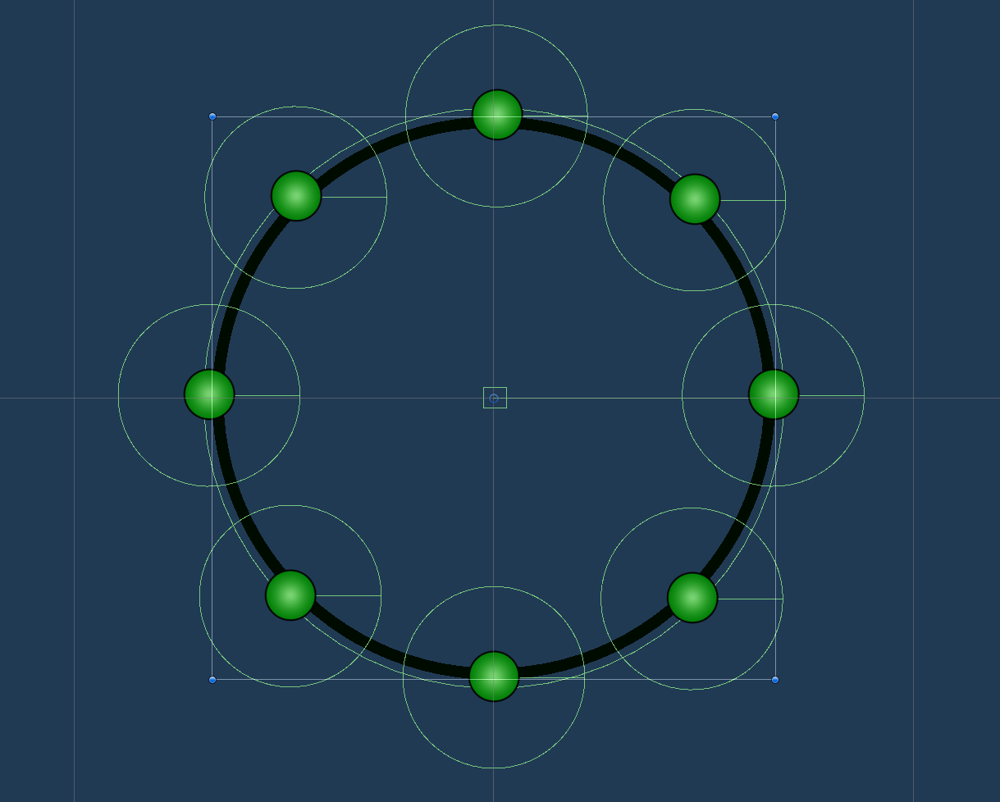
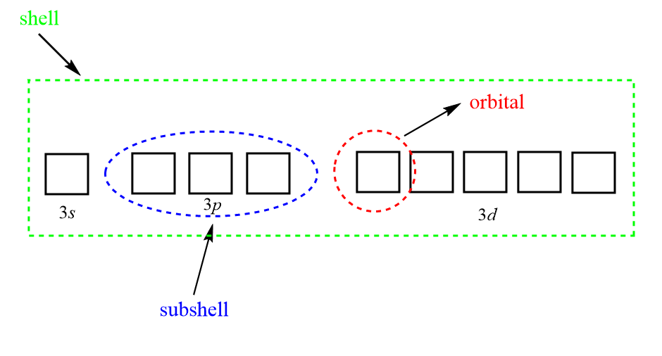
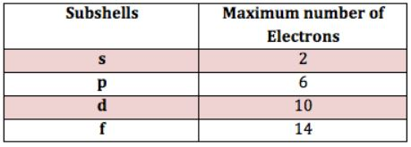

<!-- PROJECT LOGO -->

  <h3>
     
    Jaber Chem
  </h3>

   

 
 

 

 
 

## Project Info
**Role:** Game Programmer
 
**Team Size:** 8
 
**Duration:** 2 week
 
**Tech:** Unity, C#, DoTween

> [!NOTE]
> **Installation GUIDE:**
>  
> Unity Version: 2020.3.34f1

## Introduction

During my time at GamifierSA, I worked on the Jaber Chem educational project, where I was responsible for programming an Electron Configuration mini-game. The game was inspired by the rapid-fire format of WarioWare, Inc.: Mega Microgames! (2003) and aimed to teach chemistry concepts through fast-paced challenges. My primary role was to implement the game's mechanics, logic, and functionality based on the design specifications provided by the team.

  
  

##  Main Mechanics

### Number of electrons in each shell
The number of electrons in each shell follows a pattern based on the quantum mechanical model of the atom. The maximum number of electrons that can occupy a particular shell is given by the formula 2n2, where "n" represents the shell number.
Here's a summary of the number of electrons in each shell:
- Shell K (n = 1): Maximum 2 electrons
- Shell L (n = 2): Maximum 8 electrons
- Shell M (n = 3): Maximum 18 electrons
- Shell N (n = 4): Maximum 32 electrons
- Shell O (n = 5): Maximum 50 electrons
- Shell P (n = 6): Maximum 72 electrons
 
I devised a calculation to distribute electrons in a circular pattern. Considering that a complete circle consists of 360 degrees, I divided this value by the number of electrons in the shell. This allowed me to spawn an electron point for each segment determined by the calculation.

  
  

### Orbital Notation:

To represent the orbital notation, it is necessary to have knowledge of the principal energy level (shell), the specific subshell (s, p, d, f), and the maximum number of electrons that can occupy each subshell.

  
  
    

I have created a sample calculation to automatically generate the orbital notation for each shell. 

## Credits

Developed during my time at **Gamifier** as part of a team of 8. I focused on:
- One mini game
- Code implementation for electron logic
- Orbital distribution algorithms
