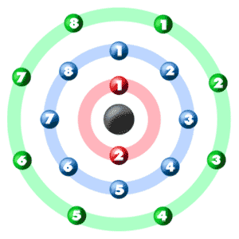

<!-- PROJECT LOGO -->

  <h3>
     
    Jaber Chem
  </h3>

   

 

 

 

## &nbsp;

### Introduction

During my time at GamifierSA, I worked on the Jaber Chem educational project, where I was responsible for programming an Electron Configuration mini-game. The game was inspired by the rapid-fire format of WarioWare, Inc.: Mega Microgames! (2003) and aimed to teach chemistry concepts through fast-paced challenges. My primary role was to implement the game's mechanics, logic, and functionality based on the design specifications provided by the team.

  
  

## &nbsp;

### Project Info
**Role:** Game Programmer
 
**Team Size:** 8
 
**Duration:** 2 week
 
**Tech:** Unity, C#, DoTween

## &nbsp;

###  Main Mechanics

- The game randomly generates a **4-digit number** using digits from 0 to 9, with **no repeating digits**.
- Players attempt to guess this number.
- After each guess:
  - A **bull** means a correct digit in the correct position.
  - A **cow** means a correct digit but in the wrong position.

The player uses these clues to narrow down the correct number through logic and deduction.

## &nbsp;

### Features

#### High Score System with PlayFab

  
  

I integrated the **PlayFab API** to allow player names and high scores to be saved online.  
A custom service manager sends requests from Unity to the PlayFab server, storing player data and displaying a leaderboard.  
Players can also generate random names for a faster experience.

## &nbsp;

#### Share Results on Social Media

To increase player engagement, I added a feature that allows players to **share their game results** on social media.  
I captured all guesses and progress in a single camera view and generated a combined screenshot. Players can then share this image with a custom message.

## &nbsp;

#### Enhanced Guessing Aids

To help players guess more effectively, I added interactive **analytics tools**:
- Players can **click numbers** to highlight or mark them.
- Two types of marks are supported: `"X"` for ruled-out digits and `"O"` for likely candidates.

> [!NOTE]
> **Installation GUIDE:**
>  
> Unity Version: 2020.3.34f1
